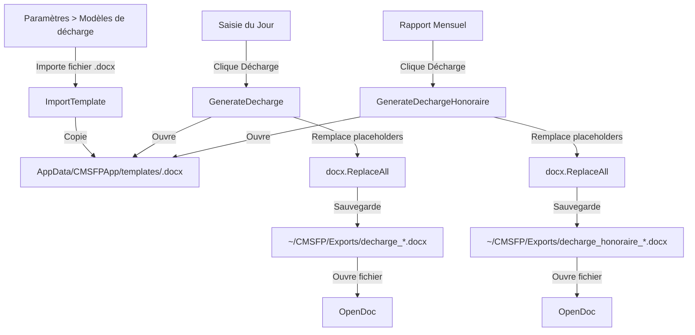

# Plan: Template-Based Décharge Generation

## Objectif
Remplacer la génération par code XML dur des documents de décharge (dépenses et honoraires) par un système où l'utilisateur importe ses propres fichiers `.docx` via la page Paramètres, et l'application utilise `go-docx` (`docx.Open()` + `doc.ReplaceAll()`) pour remplacer les placeholders.

---

## Architecture

## Templates et Placeholders

### `decharge-depense.docx` (utilisé par `GenerateDecharge`)
| Placeholder | Description |
|---|---|
| `{BENEFICIARY}` | Nom complet du bénéficiaire |
| `{AMOUNT}` | Montant en chiffres (ex: 100 000) |
| `{AMOUNT_WORDS}` | Montant en lettres (ex: cent mille) |
| `{DESCRIPTION}` | Motif/description de la dépense |
| `{DATE}` | Date formatée (ex: le 24 Juin 2026) |
| `{CIN}` | Numéro de CNI |

### `decharge-honoraire.docx` (utilisé par `GenerateDechargeHonoraire`)
| Placeholder | Description |
|---|---|
| `{NOM}` | Nom de famille |
| `{PRENOM}` | Prénom |
| `{FONCTION}` | Fonction/role |
| `{AMOUNT_WORDS}` | Montant en lettres |
| `{AMOUNT}` | Montant en chiffres avec séparateurs |
| `{MOIS}` | Mois concerné (ex: Avril) |
| `{CNI}` | Numéro de CNI |
| `{DATE}` | Date formatée (ex: le 24 Juin 2026) |

---

## Étapes d'implémentation

### Étape 1: Backend - `ImportTemplate` et `GetDechargeTemplateStatus` dans `app.go`

**Nouvelle fonction `ImportTemplate(templateType string) (string, error)`**
- Ouvre une boîte de dialogue de sélection de fichier filtrée sur `*.docx`
- Copie le fichier sélectionné vers `config.GetTemplateDir()` avec le nom `{templateType}.docx`
- Retourne un message de succès

**Nouvelle fonction `GetDechargeTemplateStatus() (map[string]bool, error)`**
- Vérifie l'existence de `decharge-depense.docx` et `decharge-honoraire.docx` dans le dossier templates
- Retourne une map: `{"decharge-depense": true, "decharge-honoraire": false}`

### Étape 2: Backend - Refactor `GenerateDecharge` et `GenerateDechargeHonoraire`

**Modifier `GenerateDecharge()`** (lignes ~1321-1368)
- Remplacer `createDechargeTemplateBytes()` + `docx.OpenBytes()` par `docx.Open(filepath.Join(config.GetTemplateDir(), "decharge-depense.docx"))`
- Si le fichier template n'existe pas, retourner une erreur indiquant à l'utilisateur de configurer le template dans Paramètres
- Conserver toute la logique de remplacement de placeholders et de sauvegarde

**Modifier `GenerateDechargeHonoraire()`** (lignes ~1553-1618)
- Même approche: `docx.Open(filepath.Join(config.GetTemplateDir(), "decharge-honoraire.docx"))`
- Si le fichier template n'existe pas, retourner une erreur

**Supprimer** (ou commenter) les fonctions obsolètes:
- `createDechargeTemplateBytes()`
- `createDechargeHonoraireTemplateBytes()`

### Étape 3: Frontend - Ajouter les méthodes au `FinanceService`

**Dans `frontend/src/app/core/services/finance.service.ts`**
- Importer `ImportTemplate` et `GetDechargeTemplateStatus` depuis les bindings Wails
- Ajouter `importDechargeTemplate(templateType: string): Promise<string>`
- Ajouter `getDechargeTemplateStatus(): Promise<Record<string, boolean>>`

### Étape 4: Frontend - Section "Modèles de décharge" dans Paramètres

**Dans `frontend/src/app/pages/settings/settings.component.ts`**

Modifications:
1. Ajouter un item `{ key: 'modeles', label: 'Modèles de décharge', icon: 'description' }` dans le groupe "Application" de `navGroups`
2. Ajouter l'import de `ImportTemplate` et `GetDechargeTemplateStatus`
3. Ajouter les variables d'état:
   - `templateStatus: Record<string, boolean> = {}`
   - `importingTemplate: string | null = null`
4. Ajouter la méthode `loadTemplateStatus()` appelée dans `ngOnInit()`
5. Ajouter la méthode `async importTemplate(type: string)`
6. Ajouter le template HTML pour la section `modeles` avec:
   - Deux cartes pour chaque type de template
   - Affichage du statut (importé / non importé)
   - Bouton d'import
   - Note d'information sur les placeholders requis

### Étape 5: Frontend - Vérification template avant génération

**Option recommandée:** Vérifier au moment de la génération et afficher une erreur claire si le template n'est pas configuré.

**Dans `saisie-jour.component.ts`** - `generateDecharge()`:
- Ajouter un try/catch qui attrape l'erreur "template not found" du backend
- Afficher un message导向 vers Paramètres

**Dans `rapport-mensuel.component.ts`** - `generateDechargeForHonoraire()`:
- Même approche

### Étape 6: Régénérer les bindings Wails

- Exécuter `wails generate module` (ou faire un `wails build`) pour régénérer les fichiers dans `frontend/wailsjs/go/main/App.js` et `App.d.ts`
- Sinon, les mettre à jour manuellement avec les nouvelles fonctions

---

## Fichiers modifiés

| Fichier | Type de modification |
|---|---|
| `app.go` | Ajout `ImportTemplate`, `GetDechargeTemplateStatus`; refactor `GenerateDecharge`, `GenerateDechargeHonoraire`; suppression `createDechargeTemplateBytes`, `createDechargeHonoraireTemplateBytes` |
| `frontend/src/app/core/services/finance.service.ts` | Ajout méthodes `importDechargeTemplate`, `getDechargeTemplateStatus` |
| `frontend/src/app/pages/settings/settings.component.ts` | Ajout section "Modèles de décharge" avec template HTML, variables d'état, méthodes |
| `frontend/wailsjs/go/main/App.js` | Mise à jour bindings |
| `frontend/wailsjs/go/main/App.d.ts` | Mise à jour déclarations TypeScript |

## Notes importantes

- Le dossier templates existe déjà via `config.GetTemplateDir()` → `{AppData}/CMSFPApp/templates/`
- La librairie `go-docx` est déjà dans les dépendances (`github.com/lukasjarosch/go-docx v0.5.0`)
- La fonction `numberToWords()` est conservée car réutilisable
- Les templates DOCX doivent être créés par l'utilisateur avec les placeholders entre accolades `{PLACEHOLDER}`
- Pas d'estimation de temps fournie
