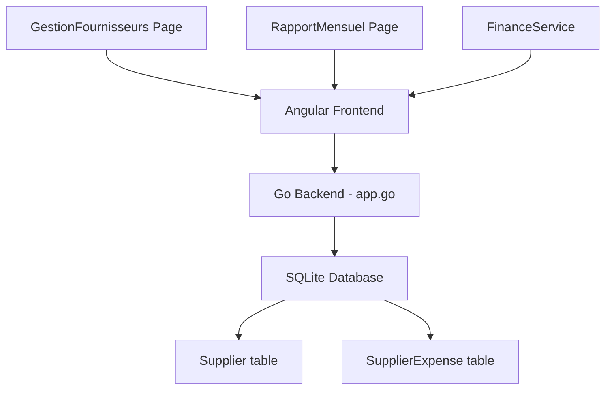
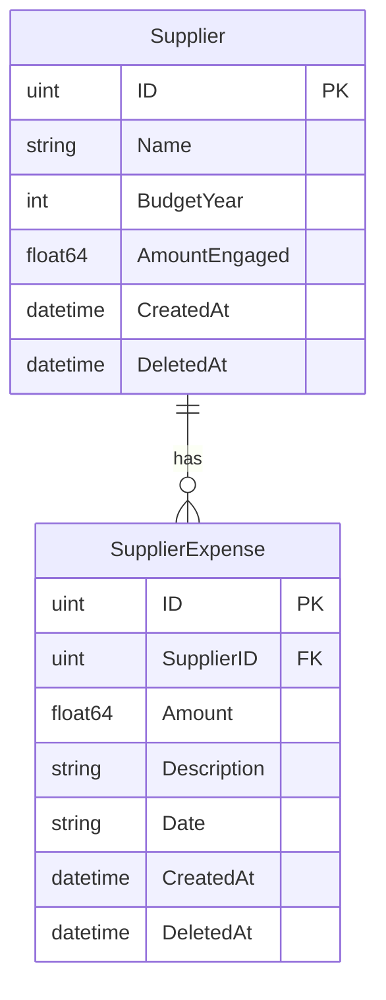

# Plan: Suivi Budget avec les Fournisseurs

## Overview

Add a supplier budget tracking feature to the CMSFP medical app. Users can:
1. Create and manage suppliers with an annual committed budget amount
2. Record expenses against each supplier
3. Automatically calculate remaining budget (Montant engagé - Dépenses)
4. View a summary table in the Rapport Mensuel page

---

## Architecture



## Data Model



---

## Detailed Tasks

### TASK 1: Add New Models in `pkg/models/finance.go`

Add two new structs after the existing models:

**Supplier model:**
- `gorm.Model` (embedded for ID, CreatedAt, UpdatedAt, DeletedAt)
- `Name string` - supplier name
- `BudgetYear int` - budget year
- `AmountEngaged float64` - committed amount

**SupplierExpense model:**
- `gorm.Model` (embedded)
- `SupplierID uint` - FK to Supplier
- `Amount float64` - expense amount
- `Description string` - what the expense was for
- `Date string` - date of expense (YYYY-MM-DD format)

Also add a response DTO for the budget summary:

**SupplierBudgetSummary (DTO):**
- `ID uint`
- `Name string`
- `BudgetYear int`
- `AmountEngaged float64`
- `TotalExpenses float64`
- `Remaining float64` (= AmountEngaged - TotalExpenses)

### TASK 2: Register Models in Migration

In `pkg/db/sqlite/migration.go`, add `&models.Supplier{}` and `&models.SupplierExpense{}` to the `AutoMigrate` call.

### TASK 3: Add Go API Methods in `app.go`

Add the following exported methods to the `App` struct. Follow the existing patterns (use `sqlite.GlobalDB.GetDB()`, GORM queries).

**Supplier CRUD:**
- `CreateSupplier(name string, budgetYear int, amountEngaged float64) (*models.Supplier, error)` - creates a new supplier
- `UpdateSupplier(id uint, name string, budgetYear int, amountEngaged float64) (*models.Supplier, error)` - updates supplier
- `DeleteSupplier(id uint) error` - soft-deletes a supplier
- `GetSuppliers(budgetYear int) ([]models.Supplier, error)` - returns suppliers filtered by budget year
- `GetAllSuppliers() ([]models.Supplier, error)` - returns all suppliers

**Supplier Expenses:**
- `AddSupplierExpense(supplierID uint, amount float64, description string, date string) (*models.SupplierExpense, error)` - records an expense
- `DeleteSupplierExpense(id uint) error` - soft-deletes an expense
- `GetSupplierExpenses(supplierID uint) ([]models.SupplierExpense, error)` - returns all expenses for a supplier

**Budget Summary:**
- `GetSupplierBudgetSummary(year int) ([]models.SupplierBudgetSummary, error)` - for each supplier with matching budget year, compute total expenses and remaining. SQL: JOIN Supplier with SupplierExpense, GROUP BY supplier.

### TASK 4: Regenerate WailsJS Bindings

After the Go changes are complete, regenerate the TypeScript bindings by running:
```bash
cd frontend && npx wails generate module
```
This will update:
- `frontend/wailsjs/go/main/App.d.ts` (add new function signatures)
- `frontend/wailsjs/go/main/App.js` (add JS wrappers)
- `frontend/wailsjs/go/models.ts` (add new model types)

### TASK 5: Update FinanceService

In `frontend/src/app/core/services/finance.service.ts`:

Add imports for new Wails functions and new model types. Add methods:

```typescript
// Supplier CRUD
createSupplier(name: string, budgetYear: number, amountEngaged: number): Promise<Supplier>
updateSupplier(id: number, name: string, budgetYear: number, amountEngaged: number): Promise<Supplier>
deleteSupplier(id: number): Promise<void>
getSuppliers(budgetYear: number): Promise<Supplier[]>
getAllSuppliers(): Promise<Supplier[]>

// Supplier Expenses
addSupplierExpense(supplierID: number, amount: number, description: string, date: string): Promise<SupplierExpense>
deleteSupplierExpense(id: number): Promise<void>
getSupplierExpenses(supplierID: number): Promise<SupplierExpense[]>

// Budget Summary
getSupplierBudgetSummary(year: number): Promise<SupplierBudgetSummary[]>
```

Also export new types:
```typescript
export type Supplier = models.Supplier;
export type SupplierExpense = models.SupplierExpense;
export type SupplierBudgetSummary = models.SupplierBudgetSummary;
```

### TASK 6: Create GestionFournisseurs Page

Create `frontend/src/app/pages/gestion-fournisseurs/gestion-fournisseurs.component.ts`

This is a dedicated page for managing suppliers. Layout:

```
┌─────────────────────────────────────────────────┐
│ Header: "Gestion des Fournisseurs"              │
├─────────────────────────────────────────────────┤
│ ┌─ Add Supplier Form ─────────────────────────┐ │
│ │ Nom: [___________] Année: [____]            │ │
│ │ Montant engagé: [________]                  │ │
│ │ [Ajouter]                                   │ │
│ └─────────────────────────────────────────────┘ │
│                                                 │
│ ┌─ Supplier Budget Table ─────────────────────┐ │
│ │ Fournisseur | Année | Engagé | Dépense|Rest.│ │
│ │─────────────|───────|────────|────────|─────│ │
│ │ Supplier A  | 2026  | 5M    | 2M    | 3M   │ │
│ │            [View Expenses] [Edit] [Delete]  │ │
│ └─────────────────────────────────────────────┘ │
└─────────────────────────────────────────────────┘
```

**Features:**
- Form to add a supplier (name, budget year, amount engaged)
- List all suppliers grouped/ordered by budget year
- Each supplier row shows: Name, BudgetYear, AmountEngaged (formatted), TotalExpenses, Remaining
- For each supplier, buttons: "Dépenses" (view/add expenses), "Modifier" (edit), "Supprimer" (delete with confirmation)
- Expense modal/dialog: list of expenses with add/delete, shows running total

**Component state:**
```typescript
- suppliers: SupplierBudgetSummary[]
- editingSupplier: Supplier | null
- showExpensesFor: Supplier | null
- supplierExpenses: SupplierExpense[]
- newSupplier: { name: string, budgetYear: number, amountEngaged: number }
- newExpense: { amount: number, description: string, date: string }
```

**Standalone component with CommonModule + FormsModule.**

### TASK 7: Add Route

In `frontend/src/app/app.routes.ts`, add:
```typescript
import { GestionFournisseursComponent } from './pages/gestion-fournisseurs/gestion-fournisseurs.component';

// In children array:
{ path: 'gestion-fournisseurs', component: GestionFournisseursComponent },
```

### TASK 8: Add Navigation Links

**Sidebar** (`frontend/src/app/shared/components/sidebar/sidebar.component.ts`):
Add a new link after "Bilan annuel":
```html
<a routerLink="/gestion-fournisseurs" ...>
  <span class="material-symbols-outlined">handshake</span>
  <span>Fournisseurs</span>
</a>
```

**Mobile Nav** (`frontend/src/app/shared/components/mobile-nav/mobile-nav.component.ts`):
Add a new link:
```html
<a routerLink="/gestion-fournisseurs" ...>
  <span class="material-symbols-outlined">handshake</span>
  <span>Fournisseurs</span>
</a>
```

### TASK 9: Update RapportMensuel Component

In `frontend/src/app/pages/rapport-mensuel/rapport-mensuel.component.ts`:

Add a new section **"SUIVI BUDGET FOURNISSEURS"** after the existing "OFFRES" section (before "SYNTHÈSE FINANCIÈRE").

**Section structure:**
```html
<section>
  <div class="flex items-center gap-2 mb-3">
    <span class="w-1 h-6 bg-success rounded-full"></span>
    <h3 class="font-headline-sm ...">SUIVI BUDGET FOURNISSEURS</h3>
  </div>

  <div class="bg-surface-container-lowest border border-outline-variant rounded-xl overflow-hidden shadow-sm">
    <table class="w-full text-left border-collapse">
      <thead>
        <tr>
          <th>Nom du fournisseur</th>
          <th>Année budgétaire</th>
          <th>Montant engagé</th>
          <th>Dépense réalisée</th>
          <th>Restant</th>
        </tr>
      </thead>
      <tbody>
        @for (s of supplierBudgets; track s.ID) {
          <tr>
            <td>{{ s.Name }}</td>
            <td>{{ s.BudgetYear }}</td>
            <td>{{ s.AmountEngaged | number }}</td>
            <td>{{ s.TotalExpenses | number }}</td>
            <td>{{ s.Remaining | number }}</td>
          </tr>
        } @empty {
          <tr><td colspan="5">Aucun fournisseur pour cette année</td></tr>
        }
      </tbody>
      <tfoot>
        <tr>
          <td colspan="2">TOTAL</td>
          <td>{{ totalEngaged | number }}</td>
          <td>{{ totalExpenses | number }}</td>
          <td>{{ totalRemaining | number }}</td>
        </tr>
      </tfoot>
    </table>
  </div>
</section>
```

**Component changes:**
- Add `supplierBudgets: SupplierBudgetSummary[]` property
- In `load()`, fetch supplier budget summary for the selected year
- Add computed totals for the footer

**Fetch in load():**
```typescript
this.supplierBudgetSummary(year).then(budgets => {
  this.supplierBudgets = budgets;
});
```

### TASK 10: Verification

After all code changes:
1. Build the Go backend (`wails build` or `go build`)
2. Run the app and test:
   - Navigate to Gestion Fournisseurs page
   - Create a supplier with name, year, amount
   - Add expenses to that supplier
   - Verify remaining amount auto-calculates
   - Go to Rapport Mensuel for matching year
   - Verify supplier budget table displays correctly
   - Edit/Delete supplier works
   - Delete expense works

---

## File Change Summary

| File | Action | Description |
|------|--------|-------------|
| `pkg/models/finance.go` | Edit | Add Supplier, SupplierExpense, SupplierBudgetSummary |
| `pkg/db/sqlite/migration.go` | Edit | Add new models to AutoMigrate |
| `app.go` | Edit | Add ~7 new App methods |
| `frontend/wailsjs/go/main/App.d.ts` | Auto-gen | Regenerated bindings |
| `frontend/wailsjs/go/main/App.js` | Auto-gen | Regenerated bindings |
| `frontend/wailsjs/go/models.ts` | Auto-gen | Add new TS types |
| `frontend/src/app/core/services/finance.service.ts` | Edit | Add supplier methods |
| `frontend/src/app/pages/gestion-fournisseurs/gestion-fournisseurs.component.ts` | Create | New supplier mgmt page |
| `frontend/src/app/app.routes.ts` | Edit | Add new route |
| `frontend/src/app/shared/components/sidebar/sidebar.component.ts` | Edit | Add nav link |
| `frontend/src/app/shared/components/mobile-nav/mobile-nav.component.ts` | Edit | Add nav link |
| `frontend/src/app/pages/rapport-mensuel/rapport-mensuel.component.ts` | Edit | Add supplier budget section |
